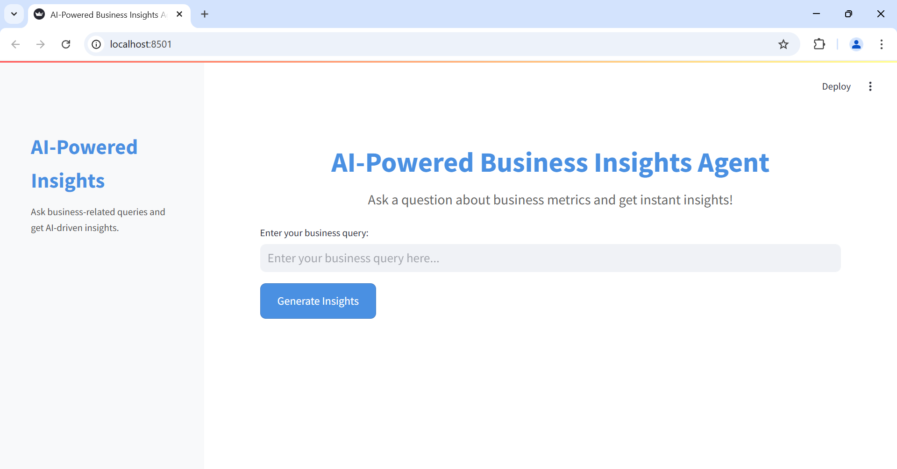
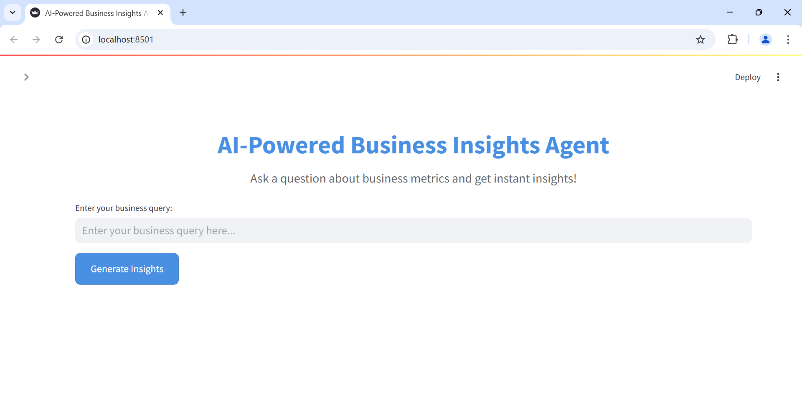
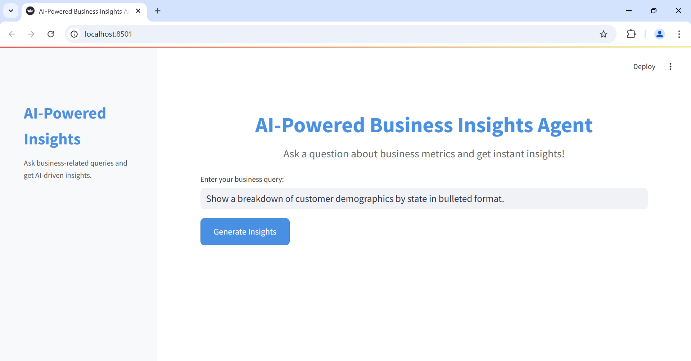
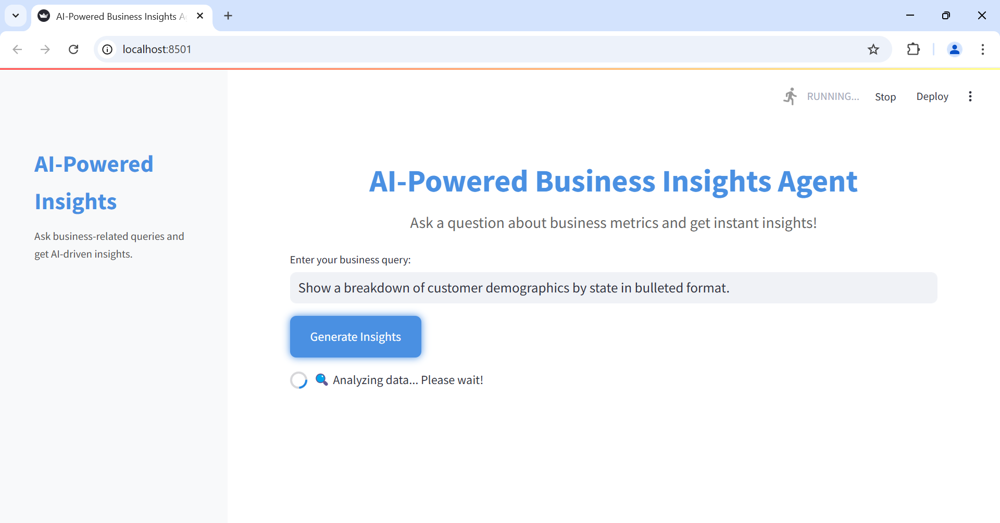
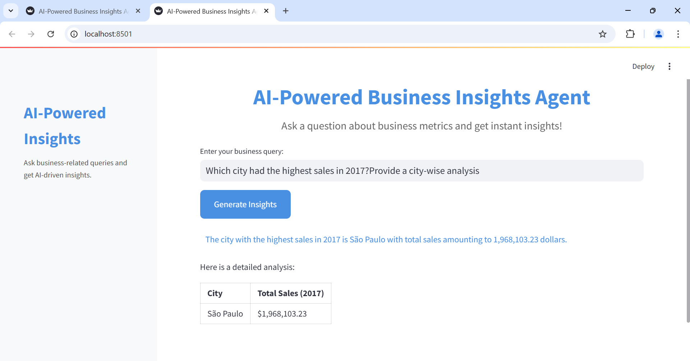
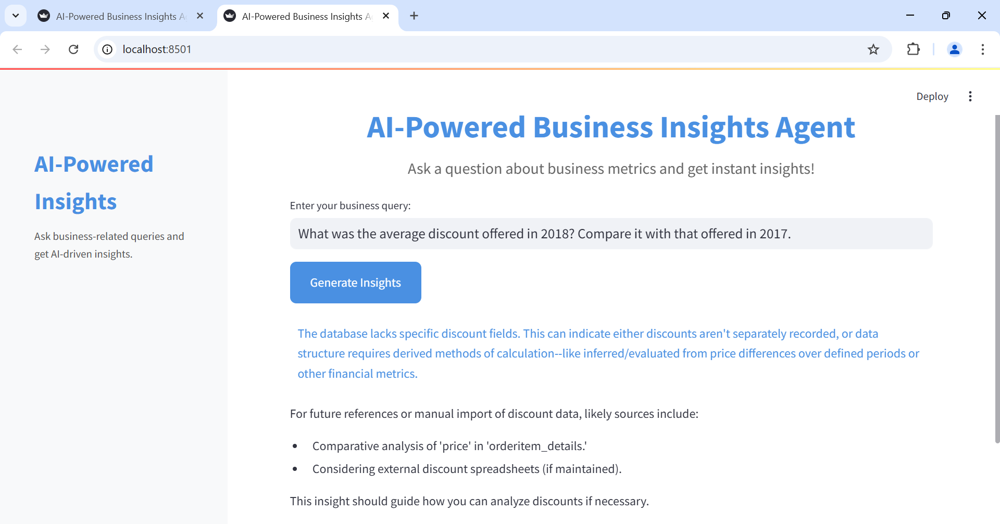
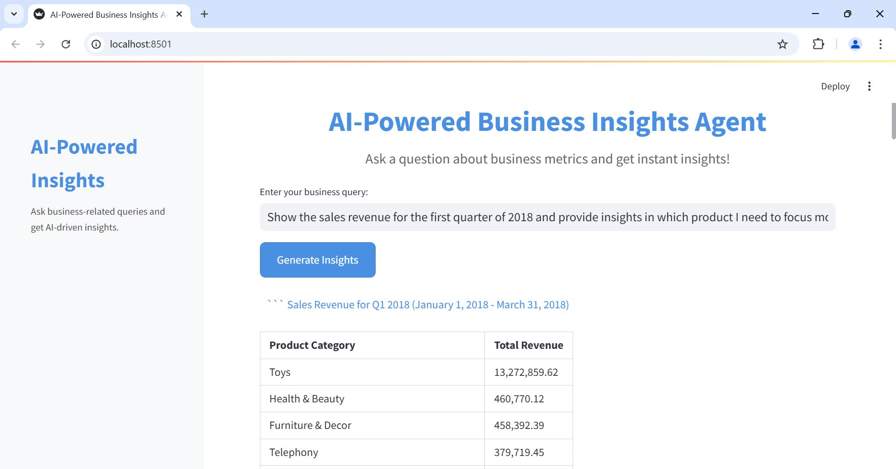
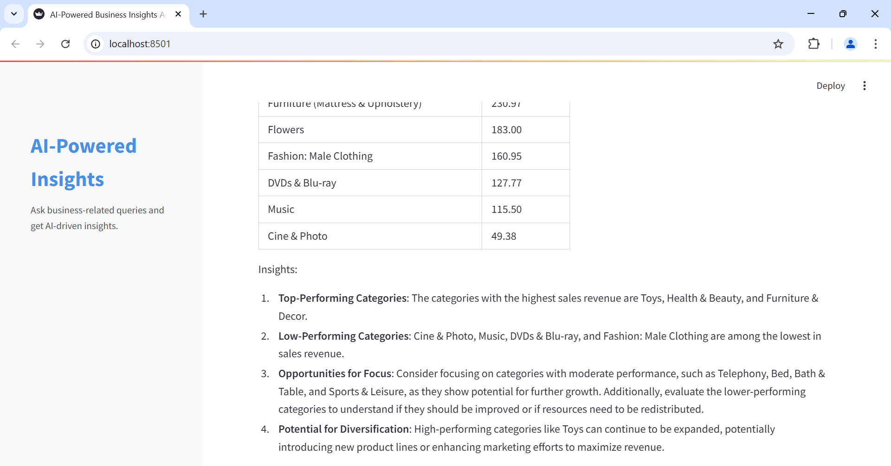
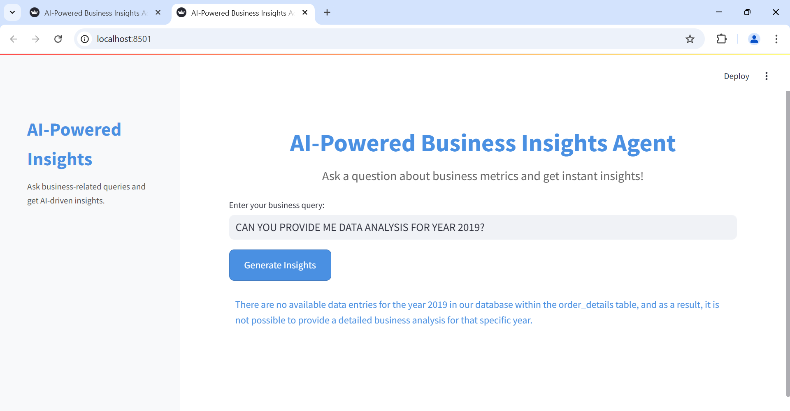

Sure! Here’s the complete updated `README.md` file with all the changes:

```markdown
# AI-Powered Business Insights Agent

## 📌 Overview
This project is an **AI-powered business insights agent** that enables users to query an **e-commerce order & supply chain database** using natural language. It leverages **CrewAI** for intelligent query processing and **Streamlit** for an interactive UI.

## 🚀 Features
- **Natural Language Querying**: Ask questions like *"What are the top 5 best-selling products?"* and get SQL-generated insights.
- **Multiple Output Formats**: View results as tables or text summaries.
- **PostgreSQL Integration**: Queries run directly on a structured database.
- **Streamlit Web UI**: User-friendly interface for seamless interaction.

## 🎯 Why Use This Project?
- Want **AI-powered business insights** without writing SQL? This agent **does it for you!**
- Provides **fast, structured answers** with **interactive tables & summaries** in **Streamlit**.
- **PostgreSQL** integration ensures **secure, reliable data access**.

## 📂 Folder Structure
```
📦 AI-Powered-Business-Insights-Agent
 ┣ 📂 agent  
 ┃ ┣ 📜 ai_agent.py  
 ┃ ┣ 📜 query_prompts.txt  
 ┣ 📂 data  
 ┃ ┣ 📂 raw_data  
 ┃ ┃ ┣ 📜 ecommerce_data.csv  (Download this from Kaggle)
 ┃ ┣ 📂 processed_data  
 ┃ ┃ ┣ 📜 cleaned_data.csv  
 ┣ 📂 database  
 ┃ ┣ 📜 schema.sql  
 ┃ ┣ 📜 import_data.py  
 ┣ 📂 frontend  
 ┃ ┣ 📜 streamlit_app.py  
 ┣ 📂 screenshots  
 ┃ ┣ 📜 homepage_1.png  
 ┃ ┣ 📜 homepage_2.png  
 ┃ ┣ 📜 query_input.png  
 ┃ ┣ 📜 processing.png  
 ┃ ┣ 📜 output_table.png  
 ┃ ┣ 📜 output_text.png  
 ┃ ┣ 📜 output_insights_1.png  
 ┃ ┣ 📜 output_insights_2.png  
 ┃ ┣ 📜 error_handling_1.png
 ┃ ┣ 📜 error_handling_2.png  
 ┣ 📜 .env.example  
 ┣ 📜 requirements.txt  
 ┣ 📜 README.md  
 ┣ 📜 .gitignore  
 ┣ 📜 config_template.yaml  
```

## 🔧 Installation & Setup
1. **Clone the repository**
   ```bash
   git clone https://github.com/your-username/AI-Powered-Business-Insights-Agent.git
   cd AI-Powered-Business-Insights-Agent
   ```

2. **Install dependencies**
   ```bash
   pip install -r requirements.txt
   ```

3. **Set up PostgreSQL database**
   - Create a `.env` file using `.env.example` and add your credentials.
   - OR set environment variables directly in your terminal.

   - Create tables using:
     ```bash
     psql -U <DB_USER> -d <DB_NAME> -f database/schema.sql
     ```
   - Import data using:
     ```bash
     python database/import_data.py
     ```

4. **Download the Dataset**
   The dataset used for this project can be downloaded from [Kaggle E-commerce Order Dataset](https://www.kaggle.com/datasets/bytadit/ecommerce-order-dataset). Once downloaded, place the dataset in the `data/raw_data/` folder for proper functionality.

5. **Run the AI Agent**
   ```bash
   python agent/ai_agent.py
   ```

6. **Launch Streamlit UI**
   ```bash
   streamlit run frontend/streamlit_app.py
   ```

## 🛡️ Security Measures
- API keys and database credentials are stored in `config.yaml`. **DO NOT** commit secrets.
- Use `config_template.yaml` as a reference.
- Add `.env` file for sensitive credentials in production.

## 🖼️ Screenshots
| Feature        | Screenshot |
|---------------|-----------|
| Homepage      | ,  |
| Query Input   |  |
| Processing    |  |
| Output Table  |  |
| Output Text   |  |
| Output Insights  | ,  |
| Error Handling| ,  |

## 📝 License
This project is **MIT licensed**. Feel free to use and modify it.

---

🌟 **Star this repo if you find it useful!**
```
